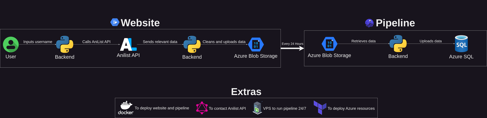
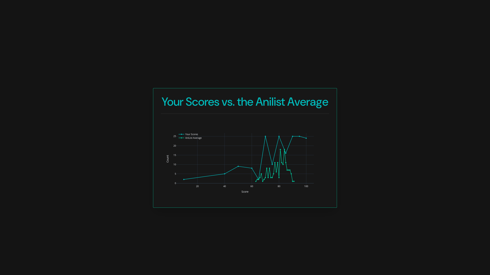
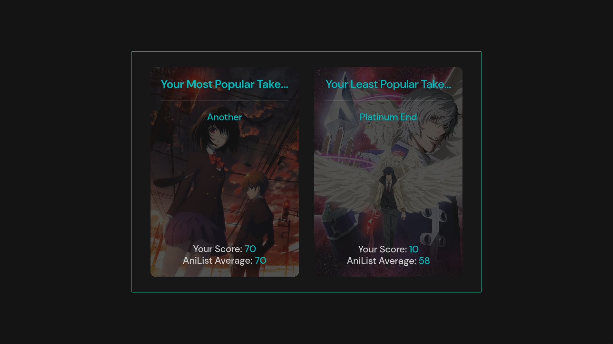
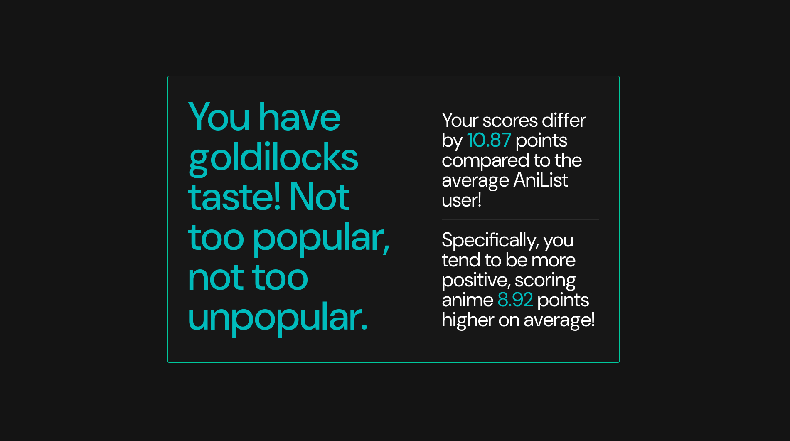
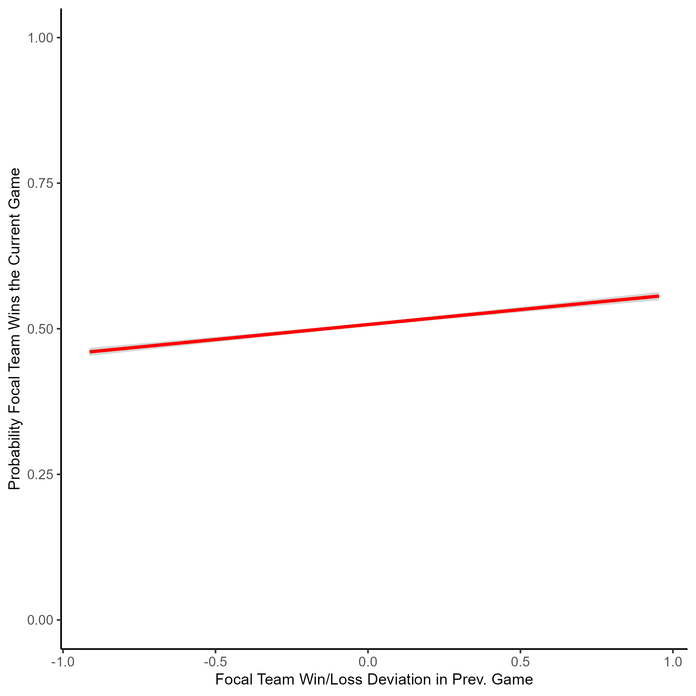
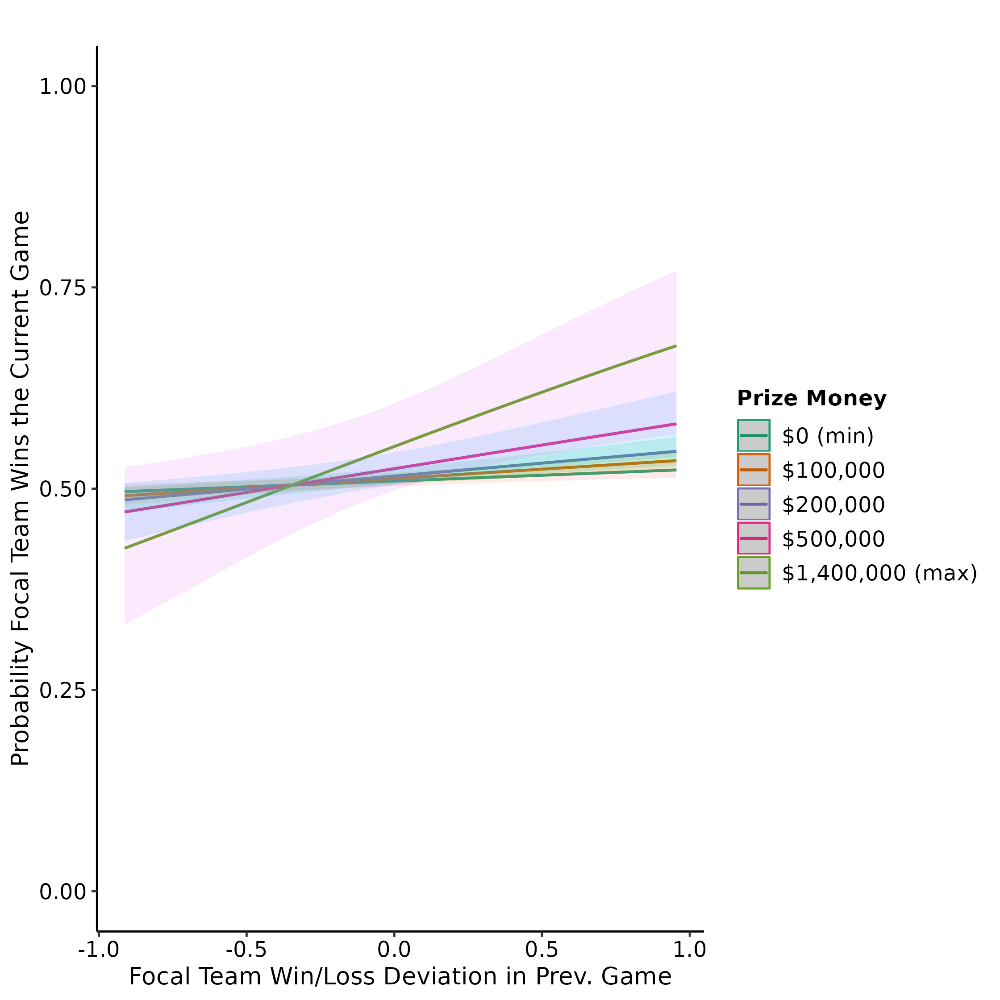

# Kiran Malhotra Portfolio

# [Popularity Tool for Anilist](https://github.com/kay-mw/anilist-popularity-project)

## Motivation

This project was driven by my interest in understanding how people's anime
preferences align with the broader community. To explore this, I developed a web
application that compares an individual's AniList data with site-wide trends.

## Project Overview

_Python_ | _SQL_ | _Dagster_ | _Github Actions_ | _Azure (SQL, Blob Storage)_ |
_GCP (Cloud Run, Artifact Registry)_

- **User Interaction**: Users enter their AniList username, triggering the
  backend to extract, clean, and store their public AniList data via the
  official API.
- **Data Pipeline**: Processed data is stored in Azure Blob Storage and
  automatically transferred to an Azure SQL data warehouse on a 24-hour
  schedule.
- **Continuous Integration (CI)**: Includes linting, mock API calls, and
  automated website testing to verify functionality and data integrity.
- **Data Quality Assurance**: Integrates checks both in the API backend and
  within the data pipeline, preventing the upload of incomplete or innacurate
  data to the warehouse.
- **Continuous Deployment (CD)**: Automates the deployment of the Dagster
  pipeline to a VPS, alongside Docker builds and pushes to Google Cloud Artifact
  Registry.
- **User Experience**: The tool provides personalized insights through
  visualizations, showcasing how a user's anime taste compares to the community
  average.

Explore the tool on the <a
  href="https://pop-tool-anilist-ftybdinz2q-nw.a.run.app/" target="_blank">website</a>, or
preview the features through the examples below.

# [The Impact of Winner and Loser Effects on eSports Competitions (Dissertation)](https://github.com/kay-mw/esports_wleffects)

## Project Overview

#### _Python_ | _R_

- Extracted 41,421 CS:GO matches from a REST API using Python.
- Restructed the data to represent 91,551 individual games instead of matches.
- Converted prize money amounts for over 40 different currencies using
  historical exchange rates.
- Analyzed data using a general linear mixed effects model, and visualised data
  using ggplot and SJPlot (see below).

