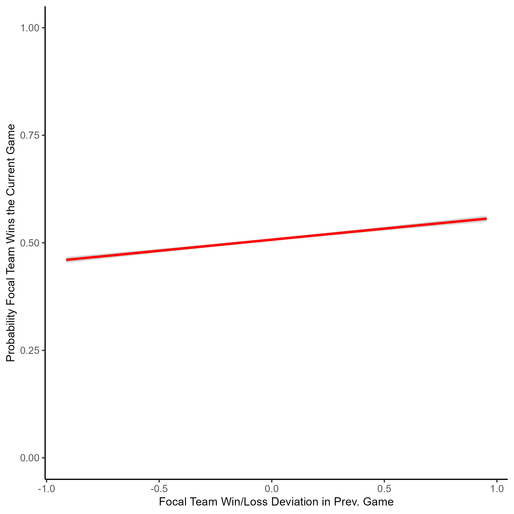
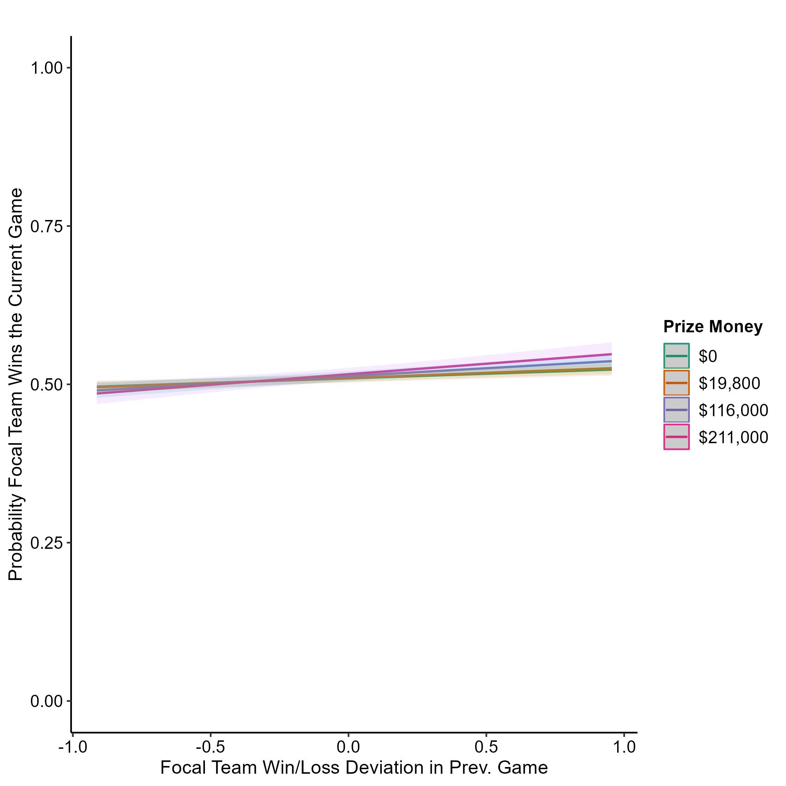

# Kiran Malhotra Portfolio

# Project 1: Anilist Popularity Project

[REPO](https://github.com/kay-mw/anilist-popularity-project)

## Project Overview

#### _Python_ | _SQL_ | _Azure_ | _Terraform_

- Created a Python script that extracts user and site-wide anime data from the AniList GraphQL API.
- Transformed the data using Pandas and performed analysis to identify the user's most "popular" and "unpopular" anime opinions.
- Incorporated data quality checks with Great Expectations.
- Deployed infrastructure to Azure using Terraform, then uploaded the data to an Azure SQL Database using SQLAlchemy. 
- Structured tables using Kimball methodology.
- Utilised a combination of `MERGE`, `UPDATE`, and `INSERT` statements to both add data for new users and update records of existing users.
- Created a basic web interface using Flask and Jinja2 to facilitate the data pipeline (see below).

# Project 2: The Impact of Winner and Loser Effects on eSports Competitions (Dissertation)

[REPO](https://github.com/kay-mw/esports_wleffects)

## Project Overview

#### _Python_ | _R_  

- Extracted 41,421 CS:GO matches from a REST API using Python.
- Restructed the data to represent 91,551 individual games instead of matches.
- Converted prize money amounts for over 40 different currencies using historical exchange rates.
- Analyzed data using a general linear mixed effects model, and visualised data using ggplot and SJPlot (see below).

