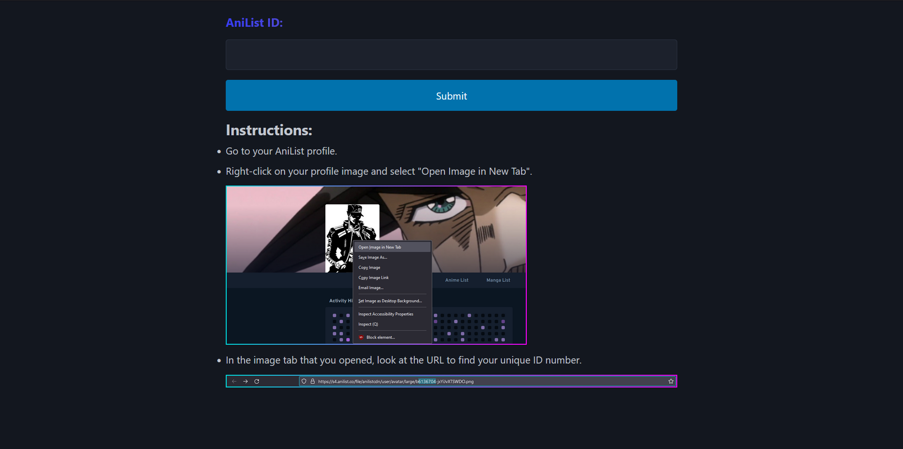
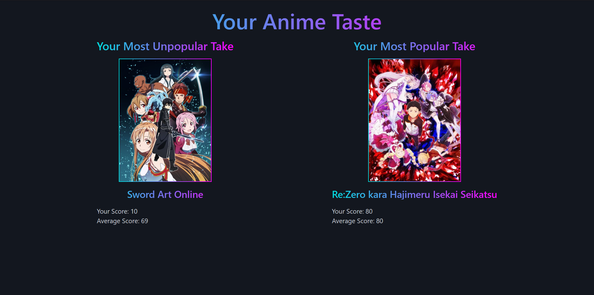

# Kiran Malhotra Portfolio

# Project 1: Anilist Popularity Project

[REPO](https://github.com/kay-mw/anilist-popularity-project)

## Project Overview

[AniList](https://anilist.co) is a website that allows users to catalog, score, and discuss the anime they have watched. The website is run using the [AniList GraphQL API](https://anilist.gitbook.io/anilist-apiv2-docs/), which is publicly available for use. As an AniList user myself, I wanted to see if I could use this API to extract unique user insights. The goal was to create an ETL (Extract, Transform, Load) pipeline that could calculate a user's most "popular" and "unpopular" anime takes, and display the results to them on a basic web interface. This approach was inspired by [Obscurify](https://www.obscurifymusic.com), a website that uses the Spotify API to identify how popular your music taste is based on the obscurity of the songs you listen to.

### Basic Outline

1. Create a Python script that could extract user anime data and site-wide data for those anime from the AniList API.
2. Transform this data into a usable format and perform basic analysis to identify the user's most "popular" and "unpopular" anime opinions.
3. Upload the data to a cloud SQL database (in this case, Azure).
4. Create a basic web interface to facilitate this pipeline, including a page where users could enter their ID, and a dashboard page that displays their results.

## Step 1: Extract

The first step was to figure out how to extract the required data. Prior to this project, I had never worked with a GraphQL API before, so the first step was understanding the basics of GraphQL queries, namely the syntax, variables, and navigating the JSON structure. The AniList API [documentation](https://anilist.gitbook.io/anilist-apiv2-docs/overview/graphql/getting-started) was very helpful in this regard.

I then constructed my first GraphQL (GQL) query:
```
query ($page: Int, $id: Int!) {
  Page (page: $page) {
    pageInfo {
      total
      currentPage
      lastPage
      hasNextPage
      perPage
    }
    users (id: $id) {
      id
      name
      statistics {
        anime {
          scores {
            mediaIds
            score
          }
        }
      }
    }
  }
}
```
This would successfully retrieve the ID and score of each anime on a user's profile. Initially, I pasted these queries in full into my Python file, but I later set up a basic function that would load the queries so I could store them as separate .gql files.
```
def load_query(file_name):
    file_path = os.path.join("./", file_name)
    with open(file_path, "r") as file:
        return file.read()
```
I also created a function to perform API calls so that I wouldn't have to repeat the request code each time.
```
def fetch_anilist_data(query, variables):
    try:
        response = requests.post(url, json={'query': query, 'variables': variables}, timeout=10)
        response.raise_for_status()
        global response_header
        response_header = response.headers['Date']
        response_header = pd.Series(response_header)
        return response.json()
    except requests.exceptions.Timeout:
        print("Request timed out.")
        return None
    except requests.exceptions.RequestException as e:
        print(f"Error in request: {e}")
        return None
```
This was simple enough to extract user data, but as anime data contained more information per page, I would need to utilize pagination with a basic while loop.
```
while True:
    response_ids = fetch_anilist_data(query_anime, variables_anime)
    print("Fetching anime info...")
    time.sleep(5)

    page_df = pd.json_normalize(response_ids, record_path=['data', 'Page', 'media'])
    anime_info = pd.concat([anime_info, page_df], ignore_index=True)

    if not response_ids['data']['Page']['pageInfo']['hasNextPage']:
        break

    variables_anime['page'] += 1
```
Importantly, by creating a list of anime IDs from the original user query and setting that as a variable, I would extract only the anime I needed for that user.
```
id_list = user_score['anime_id'].values.tolist()

variables_anime = {
    "page": 1,
    "id_in": id_list
}
```
With this, I had extracted all the data I needed - now I had to make the response usable.

## Step 2: Transform

Upon constructing the necessary GQL queries, I proceeded to extract the relevant information from the JSON response. To extract the data from JSON and put it in a data frame, I used `pd.json_normalize`. I then performed any additional transformations depending on the output format. For user data, I had to pivot the data from wide to long using `pd.explode`. I also renamed all the columns to maintain a consistent naming template.

## Step 3: Load

### Terraform Deployment

As I had never used the Azure Cloud Platform before, I wanted to try it out for this project. After initializing my credentials using the Azure CLI, I set up the infrastructure using Terraform.
```
terraform {
  required_providers {
    azurerm = {
      source  = "hashicorp/azurerm"
      version = "~>2.0"
    }
  }
}

provider "azurerm" {
  features {}

  client_id       = var.client_id
  client_secret   = var.client_secret
  tenant_id       = var.tenant_id
  subscription_id = var.subscription_id
}

resource "azurerm_resource_group" "project-grp" {
  name     = "kiran-projects-grp"
  location = "West Europe"
}

resource "azurerm_storage_account" "anilistproject" {
  name                     = "anilistproject"
  resource_group_name      = azurerm_resource_group.project-grp.name
  location                 = azurerm_resource_group.project-grp.location
  account_tier             = "Standard"
  account_replication_type = "LRS"
}

resource "azurerm_mssql_server" "anilist-sqlserver" {
  name                         = "anilist-sqlserver"
  resource_group_name          = azurerm_resource_group.project-grp.name
  location                     = azurerm_resource_group.project-grp.location
  version                      = "12.0"
  administrator_login          = var.administrator_login
  administrator_login_password = var.administrator_login_password
}

resource "azurerm_mssql_database" "anilist-db" {
  name           = "anilist-db"
  server_id      = azurerm_mssql_server.anilist-sqlserver.id
  max_size_gb    = 4
}
```
This made setting everything up super easy.

### Data Warehouse Model

I then spent some time trying to figure out the data warehouse structure I wanted to use. I eventually decided upon creating three separate tables: one containing the user's individual score data ("user_score"), one containing site-wide anime data ("anime_info"), and another containing user/request data ("user_info").

I chose this structure because it allows for clear identification of keys. anime_id is the primary key in "anime_info", user_id is the primary key in "user_info", and these then act as foreign keys to access the data in "user_score". I felt this made the relationships between the tables clear and intuitive, and made it simple to use joins if you wanted to access all of the data with one query. 

### Data Upload

I attempted a few different methods of uploading data. I found the built-in `df.to_sql` function limiting for my use case, as I wanted to replace existing data as well as append new data, which was difficult with pandas functionality. I eventually decided upon using SQLAlchemy to create a temporary table, which would then be used as a source to perform a merge on the existing data.
```
server = "anilist-sqlserver.database.windows.net"
database = "anilist-db"
connection_string = os.getenv('AZURE_ODBC')

params = quote_plus(connection_string)
connection_url = f"mssql+pyodbc:///?odbc_connect={params}"
engine = create_engine(connection_url)

session = sessionmaker(bind=engine)

def upload_table(primary_key, table_name, df, column_1, column_2):
    with engine.connect() as connection:
        print(f"Uploading {table_name} to Azure SQL Database...")

        df.to_sql("temp_table", con=connection, if_exists="replace")

        query = (f"MERGE {table_name} AS target USING temp_table AS source "
                    f"ON source.{primary_key} = target.{primary_key} "
                    f"WHEN NOT MATCHED BY target THEN INSERT ({primary_key}, {column_1}, {column_2}) "
                    f"VALUES (source.{primary_key}, source.{column_1}, source.{column_2}) "
                    f"WHEN MATCHED THEN UPDATE "
                    f"SET target.{primary_key} = source.{primary_key}, "
                    f"target.{column_1} = source.{column_1}, "
                    f"target.{column_2} = source.{column_2};")
        print(query)
        connection.execute(text(query))
        connection.commit()

upload_table("anime_id", "anime_info", anime_info, "average_score", "title_romaji")
upload_table("anime_id", "user_score", user_score, "user_id", "user_score")
upload_table("user_id", "user_info", user_info, "user_name", "request_date")
```
This worked well - it allowed me to replace existing data to keep entries up-to-date, while appending any new data. This enabled the system to keep all the information as current as possible, while allowing new users or profile updates to be appended to the table.

## Step 4: Web App

With this, the data engineering side of this project was essentially finished! Now I wanted to create a basic web interface, both for fun and to make this project feel more complete.

### Flask + Jinja2

I set up a basic HTML website and Flask backend that allowed a user to enter their AniList ID, stored the POST request, and then sent this as an argument to the API request Python module (which I had to wrap inside the `fetch_data(anilist_id)` function).
```
app = Flask(__name__)

anilist_fetcher = None


def process_data(anilist_id):
    global anilist_fetcher
    anilist_fetcher = FetchAnimeDataByUser(anilist_id)
    anilist_fetcher.fetch_data()


@app.route('/', methods=['GET', 'POST'])
def anilist():
    if request.method == 'POST':
        anilist_id = request.form.get('anilist_id')
        process_data(anilist_id)
        return redirect(url_for('dashboard'))
    return render_template('home.html')


@app.route('/dashboard')
def dashboard():
    return render_template(
        'dashboard.html',
        image1=anilist_fetcher.cover_image_1,
        image2=anilist_fetcher.cover_image_2,
        u_score_max=anilist_fetcher.score_max,
        u_score_min=anilist_fetcher.score_min,
        avg_score_max=anilist_fetcher.avg_max,
        avg_score_min=anilist_fetcher.avg_min,
        title_max=anilist_fetcher.title_max,
        title_min=anilist_fetcher.title_min
    )


if __name__ == '__main__':
    app.run(host='0.0.0.0', debug=True)
```
I also used Jinja2 to insert variables from the API request file into the HTML file, which was primarily used to dynamically display the user's results.
```
<div class="image-wrapper">
    <h2>Your Most Unpopular Take</h2>
    
    <h3 class="caption">{{ title_max }}</h3>
    <p style="text-align: left">
        Your Score: {{ u_score_max }}
        <br>
        Average Score: {{ avg_score_max }}
    </p>
</div>
<div class="image-wrapper">
    <h2>Your Most Popular Take</h2>
    
    <h3 class="caption">{{ title_min }}</h3>
    <p style="text-align: left">
        Your Score: {{ u_score_min }}
        <br>
        Average Score: {{ avg_score_min }}
    </p>
</div>
```
Thanks to PicoCSS for styling, I think the website ended up looking pretty decent for my first-ever website. Okay, at least the home page, maybe not the dashboard...





With this, the project was complete! I had a lot of fun making it, and I may continue working on it since it has even more potential. It would be great if I could get it to the same level as Obscurify one day.

Thank you for reading, and feel free to try the pipeline out yourself!

# Project 2: The Impact of Winner and Loser Effects on eSports Competitions (Dissertation)

## Project Overview

This project was an analytical investigation into the winner and loser effect, a phenomenon wherein winning a previous competition, in of itself, appears to increase the likelihood of winning the current competition. The focus of the project was on esport competitions, specifically CS:GO matches, which was novel since most existing literature on winner/loser effects investigated animals, not humans. Though this project was more data analysis focused, it does still follow a general ETL structure like you would see in a data engineering context. At some point I will make this a batch pipeline using an orchestration tool that automates the API requests at regular intervals.

### Basic Outline

- Extract esports data from an API.
- Transform the data into a usable format for data analysis.
- Use a general linear mixed effects model to see if, when controlling for team skill, winning/losing the previous game significantly predicts the outcome of the current game.

## Step 1: Extract

First, I searched for an API that would contain the relevant data. I used an API called [Pandascore](https://pandascore.co/), which allowed me to gather large amounts of esports game data for CS:GO.
```
import requests
from dotenv import load_dotenv
import os
import pandas as pd

load_dotenv()

headers = {
    "accept": "application/json",
    "authorization": f"Bearer {os.environ['API_KEY']}"
}

response = []
for page in range(1,2):
    url = "https://api.pandascore.co/csgo/matches/past?per_page=100&filter%5Bstatus%5D=finished&page="+str(page)
    page_response = requests.get(url, headers=headers).json()
    response.extend(page_response)

for item in response:
    for game_number,game in enumerate(item['games']):
        item['game_'+str(game_number)]=game
    for opponent_number,opponent in enumerate(item['opponents']):
        item['opponent_'+str(opponent_number)]=opponent['opponent']
    for result_number,result in enumerate(item['results']):
        item['result_'+str(result_number)]=result


df = pd.json_normalize(response)
df.drop(columns=['opponents','modified_at','slug','streams_list','live.opens_at','live.supported','live.url',
                 'videogame_title.slug','videogame.slug','winner.image_url','winner.modified_at','winner.slug',
                 'serie.modified_at','serie.slug','tournament.detailed_stats','tournament.live_supported',
                 'tournament.modified_at','tournament.slug','league.image_url','league.modified_at','league.slug',
                 'league.url','detailed_stats','opponent_0.image_url','opponent_0.modified_at','opponent_0.slug',
                 'opponent_1.image_url','opponent_1.modified_at','opponent_1.slug','games','results','game_0.complete',
                 'game_0.detailed_stats','game_0.finished','game_0.id','game_0.match_id','game_0.position',
                 'game_0.winner.type','game_0.winner_type','game_1.complete','game_1.detailed_stats','game_1.finished',
                 'game_1.id','game_1.match_id','game_1.position','game_1.winner.type','game_1.winner_type',
                 'game_2.complete','game_2.detailed_stats','game_2.finished','game_2.id','game_2.match_id',
                 'game_2.position','game_2.winner.type','game_2.winner_type','game_3.complete','game_3.detailed_stats',
                 'game_3.finished','game_3.id','game_3.match_id','game_3.position','game_3.winner.type',
                 'game_3.winner_type','game_4.complete','game_4.detailed_stats','game_4.finished','game_4.id',
                 'game_4.match_id','game_4.position','game_4.winner.type','game_4.winner_type'],inplace=True)
df.style

print(df)

df.to_csv('csgo_data_game_filtered.csv')
```
This returned a dataset containing 49,421 CS:GO matches from January 2016 to October 2023.