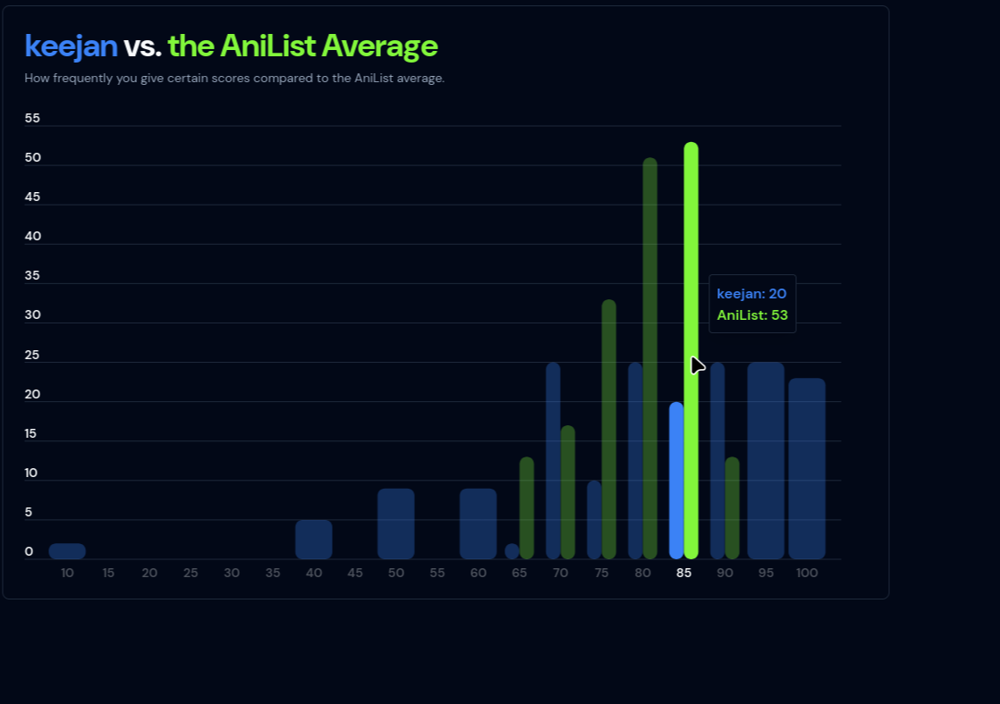

# Kiran Malhotra Portfolio

# [Popularity Tool for Anilist](https://github.com/kay-mw/anilist-popularity-project)

## Motivation

This project was driven by my interest in understanding how people's anime
preferences align with the broader community. To explore this, I developed a web
application that compares an individual's AniList data with site-wide trends.

## Project Overview

**_Python_** | **_SQL_** | **_Dagster_** | **_Github Actions_** | **_Azure (SQL,
Blob Storage)_**

- **User Interaction**: Users enter their AniList username, triggering the
  backend to extract, clean, and store their public AniList data via the
  official API.
- **Data Pipeline**: Processed data is stored in Azure Blob Storage and
  automatically transferred to an Azure SQL data warehouse on a 24-hour
  schedule.
- **Continuous Integration (CI)**: Includes linting, mock API calls, and
  automated website testing to verify functionality and data integrity.
- **Data Quality Assurance**: Integrates checks both in the API backend and
  within the data pipeline, preventing the upload of incomplete or innacurate
  data to the warehouse.
- **Continuous Deployment (CD)**: Automates the deployment of the Dagster
  pipeline to a VPS, alongside Docker builds and pushes to Google Cloud Artifact
  Registry.
- **User Experience**: The tool provides personalized insights through
  visualizations, showcasing how a user's anime taste compares to the community
  average.

Explore the tool on the <a
    href="https://www.anipop.uk" target="_blank">website</a> _**(hint: use "bob"
as your username)**_, or preview the features through the examples below!

# [Amazon Review Quality Analysis](https://github.com/kay-mw/one-star-reviews)

**_SQL_** | **_Python_** | **_Spark/Pyspark_** | **_AI_** | **_Big Data_** |
**_Delta Lake_** | **_DuckDB_** | **_Polars_** | **_Plotly_**

## Overview

I developed a data pipeline and analysis system to empirically investigate a
common assumption in online shopping: are negative reviews more informative than
positive ones? This project combined large-scale data processing, machine
learning, and statistical analysis to provide data-driven insights into review
quality patterns.

## Technical Challenges & Solutions

### Scaling Data Processing

Working with Amazon's 250GB review dataset required careful consideration of
processing approaches. I implemented two parallel solutions:

- A distributed Apache Spark pipeline to explore big data processing patterns
- A optimized single-node Polars pipeline for efficient local processing

This dual approach not only solved the immediate processing needs but also
provided valuable insights into the tradeoffs between distributed and local
processing for medium-large datasets.

### AI Pipeline

Created an end-to-end AI workflow including:

- Manual labeling of 1,020 reviews across three key dimensions (information
  detail, objectivity, product relevance)
- Fine-tuning of Gemini 1.5 Flash for automated quality assessment
- Integration of the ML pipeline with both Spark and Polars data processing
  streams

### Statistical Rigor

Employed robust statistical methods to ensure reliable conclusions:

- Analyzed 40,000+ reviews to ensure statistical significance
- Applied correlation analysis and multiple regression modeling
- Controlled for confounding variables like price and product category
- Created visualization suite for insight communication

## Key Findings & Business Impact

The analysis revealed several insights, some being counter-intuitive:

- Negative reviews (<= 3 stars) were generally more informative than positive
  reviews.
- Higher-priced items consistently received more detailed reviews
- Longer reviews tended to be higher quality, with diminshing returns
- Non-verified purchase reviews often contained more detailed information
- Helpful votes showed surprisingly little correlation with objective review
  quality

These findings have practical applications for:

- E-commerce platforms designing review systems
- Consumers looking to make informed purchase decisions
- Businesses seeking to understand customer feedback patterns

## Engineering Decisions & Tradeoffs

### Pipeline Architecture

The decision to implement both Spark and Polars pipelines was driven by:

1. Learning objectives: Understanding distributed processing patterns
2. Practical efficiency: Optimizing for actual data scale
3. Future scalability: Maintaining options for dataset growth

### Quality Assessment Approach

Chose fine-tuning over prompt engineering because of a need for consistent
evaluation across large datasets. Prompting base models often returned
inconsistent results (e.g. medicore reviews receiving 10/10s), even with
specific examples.

# [The Impact of Winner and Loser Effects on eSports Competitions (Dissertation)](https://github.com/kay-mw/esports_wleffects)

## Project Overview

#### _Python_ | _R_

- Extracted 41,421 CS:GO matches from a REST API using Python.
- Restructed the data to represent 91,551 individual games instead of matches.
- Converted prize money amounts for over 40 different currencies using
  historical exchange rates.
- Analyzed data using a general linear mixed effects model, and visualised data
  using ggplot and SJPlot (see below).

